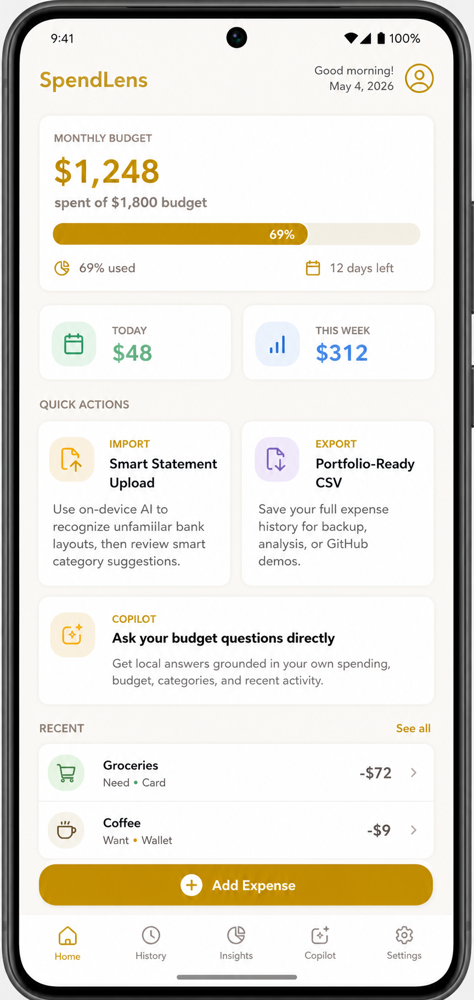
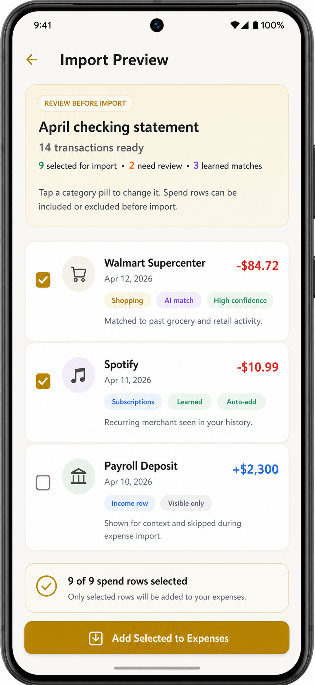
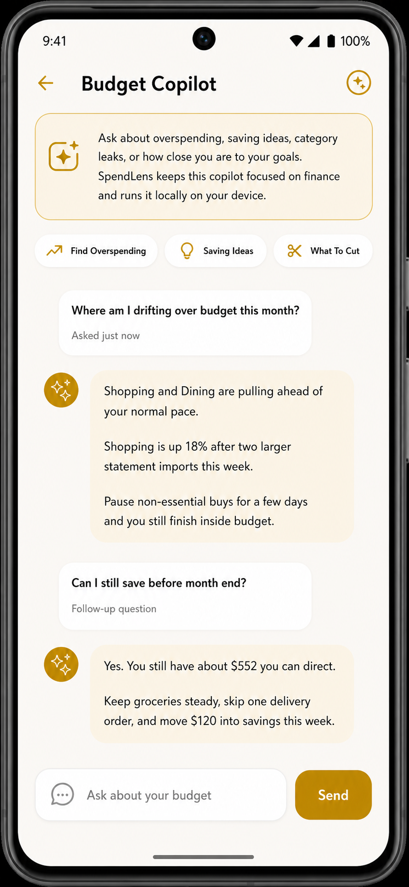

# SpendLens

Track money. Understand behavior.

SpendLens is a local-first Android budgeting app for people who want more than a basic expense tracker. It helps users log expenses with context, review bank statement imports, spot overspending earlier, export their data, and ask finance-focused questions with an on-device copilot.

## Try SpendLens

- [Live project page](https://hassanawan7890.github.io/Spendlens/)
- [Download demo APK](https://github.com/hassanawan7890/Spendlens/releases/download/v1.0-demo/SpendLens-v1.0-demo-debug.apk)
- [Release page](https://github.com/hassanawan7890/Spendlens/releases/tag/v1.0-demo)

## App previews

<p align="center">
  
  
  
</p>

## Why it stands out

SpendLens was built around a simple idea: seeing what you spent is not enough if you still do not understand why it happened. The app adds context through moods, categories, budget pace, statement review, snapshots, and private on-device guidance so budgeting feels more useful than a plain ledger.

## What it does

- Track expenses with amount, date, note, payment method, category, and mood tags
- Monitor live monthly budget progress with remaining budget, pace feedback, and threshold alerts
- Import bank CSV statements, review suggested categories, and confirm only the rows you want
- Export the expense ledger to CSV for backup and portability
- Generate monthly snapshots for reports, reflections, and category comparisons
- Surface overspending flags, hidden leaks, spending personality cues, and summary insights
- Protect personal finance data with PIN or password lock
- Show key budget numbers on an Android home screen widget
- Ask an on-device budget copilot about savings, overspending, and category leaks

## Demo release

The current public release is a showcase build meant for hands-on testing.

- Release: [`v1.0-demo`](https://github.com/hassanawan7890/Spendlens/releases/tag/v1.0-demo)
- APK: [`SpendLens-v1.0-demo-debug.apk`](https://github.com/hassanawan7890/Spendlens/releases/download/v1.0-demo/SpendLens-v1.0-demo-debug.apk)
- Includes the bundled on-device AI model used for local budget copilot and statement assistance
- Large download size is expected because the AI model is packaged inside the APK

## Tech stack

- Java
- Android SDK, Material Components, ViewBinding
- MVVM with Activities, ViewModels, Repositories, and Room DAOs
- Room / SQLite for local persistence
- LiveData for reactive UI updates
- Google MediaPipe GenAI for on-device Gemma-compatible `.task` models
- JUnit 4 for JVM unit tests
- GitHub Actions for CI
- GitHub Pages for the public showcase site

## Project snapshot

- 83 Java classes
- 20 Android activities
- 7 Room-backed tables
- 37 XML layouts
- 102 JVM unit tests

## Build locally

1. Open the project in Android Studio.
2. Set the Gradle JDK to `C:\Program Files\Eclipse Adoptium\jdk-21.0.10.7-hotspot`.
3. Let Gradle sync completely.
4. Use an emulator or Android phone with enough storage for a large build.
5. Press `Run`.
6. On first AI use, SpendLens will extract the bundled local model into app storage.

CLI checks:

```bash
./gradlew testDebugUnitTest
./gradlew assembleDebug
```

## Important note about the AI model

- The source repo intentionally does not track the bundled `.task` model because it is too large for a normal git workflow
- The downloadable demo APK does include that bundled model
- If you build from source on another machine, you will need to provide the model locally if you want the same full on-device AI experience

## Repository structure

```text
app/
  src/main/java/com/spendlens/app/
    activities/
    adapters/
    dao/
    database/
    entities/
    fragments/
    insights/
    notifications/
    repository/
    utils/
    viewmodels/
  src/main/res/
.github/workflows/
docs/
```

## Status

SpendLens builds locally, the public GitHub Pages showcase is live, and the demo APK release is available for download.
